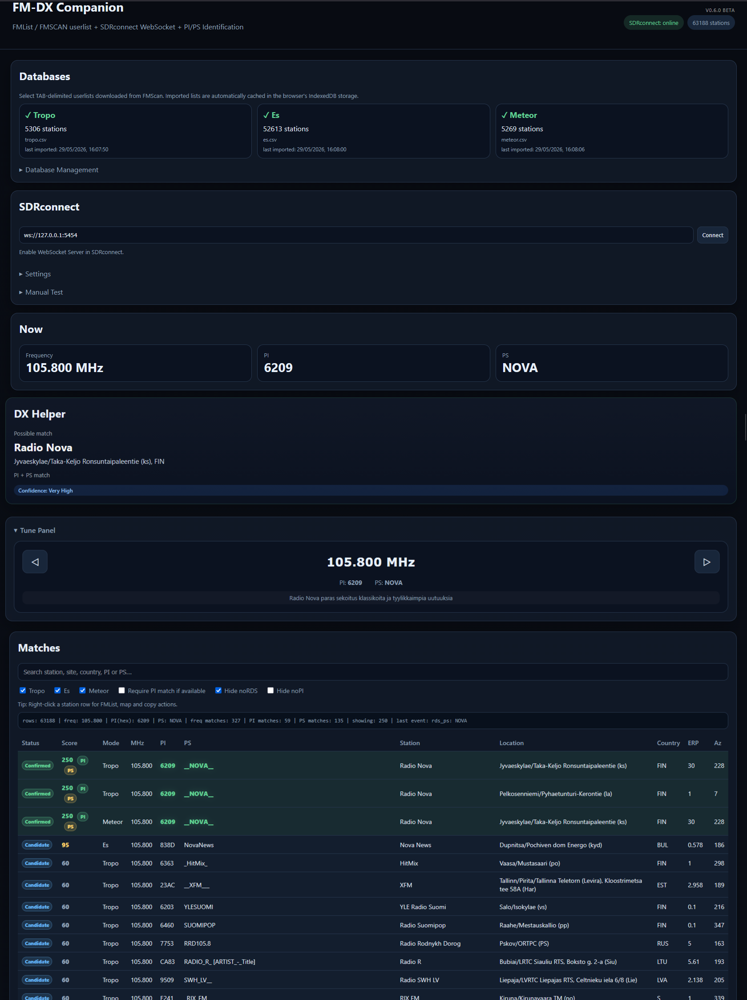

# FM-DX Companion


A lightweight browser-based companion for SDRconnect and FM-DX enthusiasts.

FM-DX Companion combines FMScan userlists, SDRconnect WebSocket data, FMList logging and FMDX Maps into a streamlined DX workflow.

---

## Screenshot



## Features

- Real-time SDRconnect integration via WebSocket
- PI and PS based station matching
- Supports FMScan Tropo, Sporadic-E and Meteor Scatter userlists
- FMList logging integration
- FMDX Maps integration
- Automatic remarks generation
- Browser-based, no installation required
- IndexedDB local storage
- Fast station lookup and ranking
- Station Search
- DX Helper panel
- Site Explorer
- Tune Panel

---

## Getting Started

### 1. Enable SDRconnect WebSocket Server

Default connection:

```text
ws://127.0.0.1:5454
```

### 2. Download FMScan Userlists

Download all three FMScan userlists:

- Tropo
- Sporadic-E
- Meteor Scatter

Export settings:

- CSV format
- TAB separator


### 3. Rename Files

Rename the downloaded files:

```text
tropo.csv
es.csv
meteor.csv
```

### 4. Import Lists

Load the files into FM-DX Companion:

| List | File |
|--------|--------|
| Tropo | tropo.csv |
| Es | es.csv |
| Meteor | meteor.csv |

The lists are stored locally in your browser and automatically restored when Companion is reopened.

### 5. FMList Login

To use FMList logging, you must be logged into FMList in the same browser.

Companion opens the FMList logging page directly and copies remarks to the clipboard automatically, but FMList authentication is handled by FMList itself.

If you are not logged in, FMList will redirect you to the login page.

### 6. Site Explorer

Site Explorer shows all known frequencies from the same transmitter site.
Useful during Es and tropo openings for quickly checking related stations and tuning SDRconnect directly from the list.

### 7. Tune Panel

FM-DX Companion now includes a polished live Tune Panel for faster manual DX work with SDRconnect.

### Features

- Large live frequency display
- Direct frequency input
- Quick tune controls
- Adjustable tuning step
  - 10 kHz
  - 50 kHz
  - 100 kHz
- Keyboard tuning support
  - Left Arrow → Tune Down
  - Right Arrow → Tune Up
- Live PI / PS display
- Live RadioText display
- Live signal monitoring
  - VHF S-Meter
  - Signal Power (dBm)
  - Signal SNR
  - Signal Strength Bar

The Tune Panel is designed for lightweight real-time band exploration while keeping the workflow fast and visually clean.

---

## Typical Workflow

1. Tune a station in SDRconnect
2. Companion receives Frequency, PI and PS data
3. Matching stations are ranked automatically
4. Right-click a station entry
5. Open FMList logging or FMDX Maps
6. Remarks are automatically copied to clipboard
7. Log the station

---

## Current Status

## v0.6.2

- New polished Tune Panel
- Live Signal Power and SNR monitoring
- VHF-style S-meter and signal bar
- Live RadioText display
- Adjustable tuning steps
  - 10 / 50 / 100 kHz
- Keyboard tuning support
- Direct frequency input
- Improved SDRconnect integration
- Cleaner and more professional UI polish

## v0.6.1

- New collapsible Tune Panel
- Live frequency, PI, PS and RadioText display
- Direct frequency input support
- ±50 kHz tuning buttons
- Silent tuning mode for rapid band browsing
- Improved SDRconnect integration
- Improved Site Explorer highlighting and tuning behavior
- Multiple tuning and RDS handling fixes

### v0.6.0

- Site Explorer

### v0.5.2

- Station Search
- DX Helper panel

### v0.5.1

* Added toast notifications for imports, logging, clipboard actions and errors
* Improved FMList logging workflow and user feedback
* Improved SDRconnect RDS handling stability
* Fixed stale PI/PS clearing issues
* Added version badge and improved footer layout
* Improved UI polish and overall usability
* Better compatibility with Companion-inspired Stylus themes

### v0.5.0.1

Quick fix release.

## Fixed

- Old PS values no longer remain visible after changing frequency
- PI value `0000` is now ignored and shown as empty
- Fixed stale RDS data handling when changing frequency. PI value 0000 is ignored.


## Notes

This release improves reliability while tuning quickly across the FM band.

Recommended update for all v0.5.0 users.

### v0.5.0 — Initial Public Beta

FM-DX Companion is already fully usable for everyday FM-DX work.

### Planned Features

- Toast notifications
- Station search
- Site Explorer
- PI history
- DX notes
- FMList Companion Theme
- FMDX Maps Companion Theme

---

## Philosophy

FM-DX Companion is intentionally lightweight.

It is **not intended to replace SDRconnect, FMList or FMDX Maps**.

Instead, it acts as a bridge between them, providing a faster and more efficient FM-DX workflow while keeping the interface simple and distraction-free.

---

## Author

**Janne Heinikangas** 🇫🇮

- Blog: https://fmatic.online
- GitHub: https://github.com/fmatic

---

*Minimal DX workflow for SDRconnect users.*
